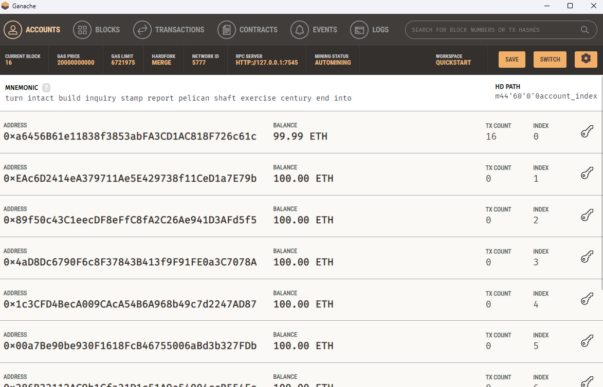
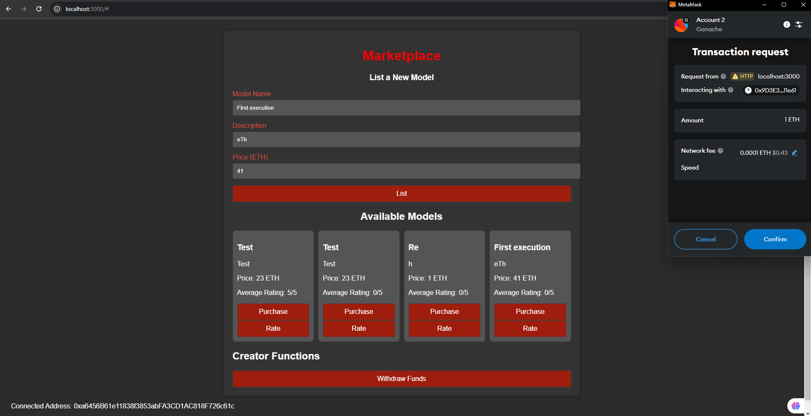
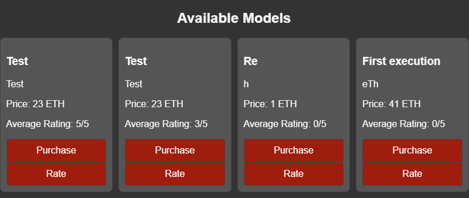
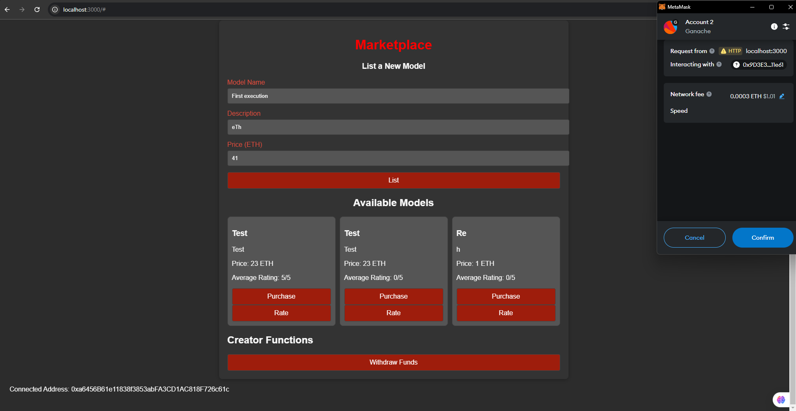
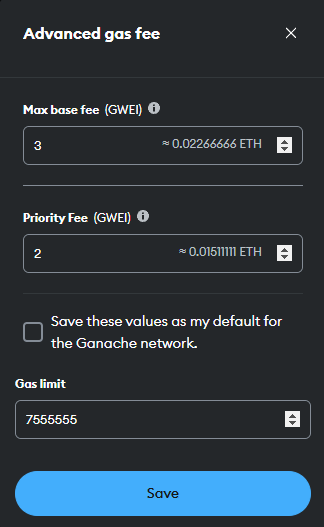

# 🛒 AI Model Marketplace 🚀

A decentralized marketplace for AI models built on Ethereum using smart contracts. Users can list, purchase, rate AI models, and creators can withdraw earnings. Powered by Truffle for smart contract development and Web3.js for Ethereum interaction.

## ✨ Features

- 📝 **List AI Models:** Add AI models with a name, description, and price.
- 💳 **Purchase Models:** Securely buy models with ETH.
- ⭐️ **Rate Models:** Leave ratings (1 to 5 stars) after purchase.
- 🔍 **View Model Details:** Explore name, description, price, and average ratings.
- 💰 **Creator Withdrawals:** Withdraw earnings from sales.

## 📂 Project Structure

The project consists of two main components:

1. **Smart Contracts:** Solidity-powered logic for the marketplace.
2. **Frontend:** HTML, CSS, and JavaScript interface to interact with Ethereum via Web3.js.

## 📁 Project Layout

```plaintext
/ai-model-marketplace
├── contracts/               # Smart contracts
│   ├── AIModelMarketplace.sol
├── migrations/              # Deployment scripts
│   ├── 2_initial_migration.js
├── index.html               # Frontend HTML page
├── style.css                # CSS styling
├── app.js                   # Web3.js logic
├── truffle-config.js        # Truffle configuration
├── package.json             # Dependencies
└── README.md                # Project documentation
```
---
### ⚙️ Installation Prerequisites
---
**Node.js & npm:** 
Download here https://nodejs.org/en

**Truffle:** Install globally:
```npm install -g truffle```

**Ganache:** 
Download here https://archive.trufflesuite.com/ganache/

**MetaMask:**
Browser extension for Ethereum interaction.
https://metamask.io/

---
### 🛠️ Steps to Set Up
---
### Step 1: Clone the repository
```
git clone https://github.com/Kuvernoori/AI.git
cd AI
```
### Step 2: Install project dependencies
```
npm install
```
### Step 3: Configure the Ethereum network
Connect **MetaMask** to a test network (e.g., **Ganache**).
Update truffle-config.js with your network settings.

### Step 4: Deploy the Smart Contract
**1.** Compile the smart contract using Truffle:
```
truffle compile
```
**2.** Deploy the contract to your chosen network:
```
truffle migrate --network development
```
### Step 5: Run the frontend
```
lite-server
```

---
### 🌟 How to Use the Marketplace
---
**1. List a Model:**
- Navigate to "List a New Model."
- Fill in **Model Name**, **Description**, and **Price** (ETH).
- Click **List Model**.


**2. View Available Models:**
- Explore listed models with their details.
- Click Purchase or Rate.


**3. Purchase a Model:**
- Click Purchase.
- Confirm the ETH payment via MetaMask.


**4. Rate a Model:**
- Click Rate.
- Submit a rating between 1 and 5 stars.

**5. Withdraw Funds:**
Creators can withdraw their earnings from sales.


---
### ⚙️ Test settings
---


---
### 📜 Smart Contract Overview
---
***Function	Description***
- listModel	Add a new AI model with name, description, and price.
- purchaseModel	Purchase a listed model by paying ETH.
- rateModel	Rate a purchased model (1 to 5 stars).
- withdrawFunds	Withdraw funds from model sales.
- getModelDetails	Retrieve details of a specific model.
- getModelsCount Get the total number of listed models.

--- 
### 🧰 Tools & Technologies
---
- Truffle: Smart contract development framework.
- Web3.js: JavaScript library for Ethereum interaction.
- Ganache: Local blockchain for testing.
- MetaMask: Browser wallet for Ethereum.

---
### 📄 License
---
This project is licensed under the [MIT License](https://opensource.org/licenses/MIT).

---
### 📧 Contact
---
For questions or feedback, reach out via GitHub issues or contact the maintainers directly.
